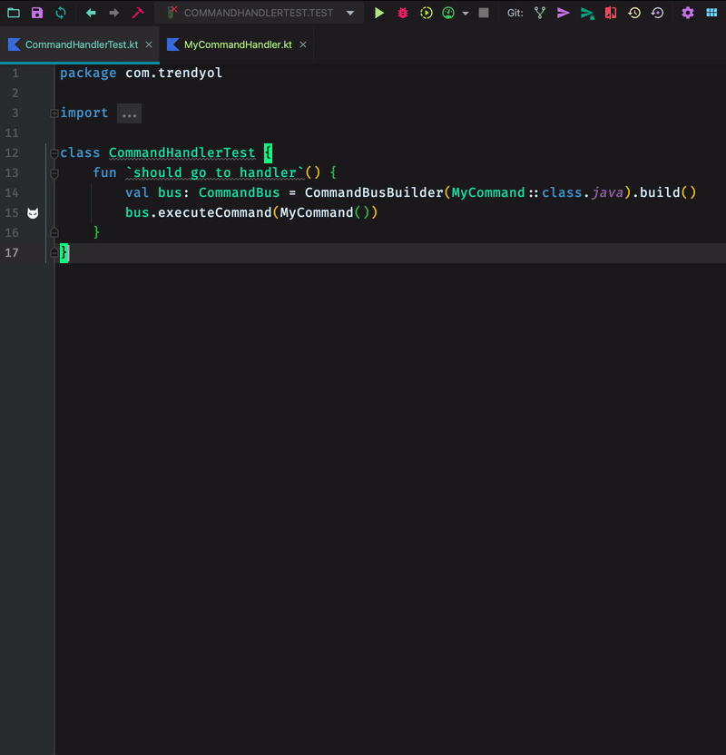

Kediatr Helper
=======================

<!-- Plugin description -->
**Kediatr Helper** is an Intellij Idea plugin that provides support for projects using [KediatR](https://github.com/Trendyol/kediatR)

### Features:
 - Gutter icons for command classes and commandBus executions
 - Go to handler functionality in Go To menu and gutter icons 

<!-- Plugin description end -->

### Usage

#### Go to handler

Toolbar action

Gutter Icon

### TODO

- [ ] Add support for finding all handlers of notification
- [ ] Change icons to svg files
- [ ] Add create handler functionality for command types
- [x] Mark types inherited from Command types
- [ ] Make project not require restart when enabling
